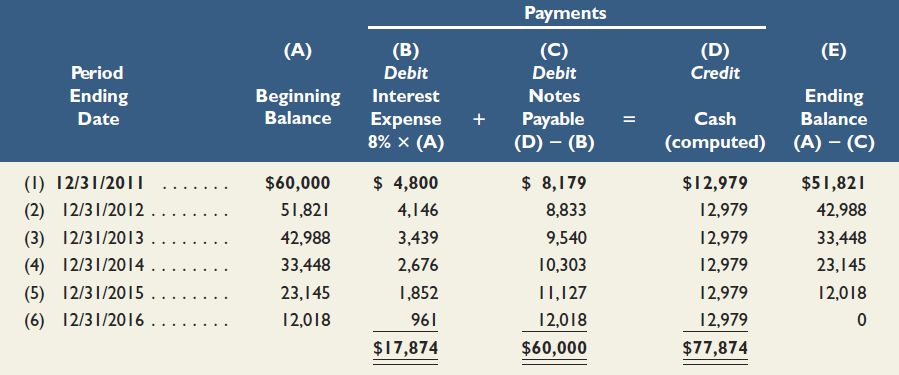

# amortization-table-generator
I made this simple bot when studying accounting. I found that doing questions related to amortization table can be automated so I make this bot to do homework for me

**example usage:**

Input the following in python to get the result from above

Begining Balance: 60000

Interest expense(?%): 8

Payment: 12979

number of year: 6
